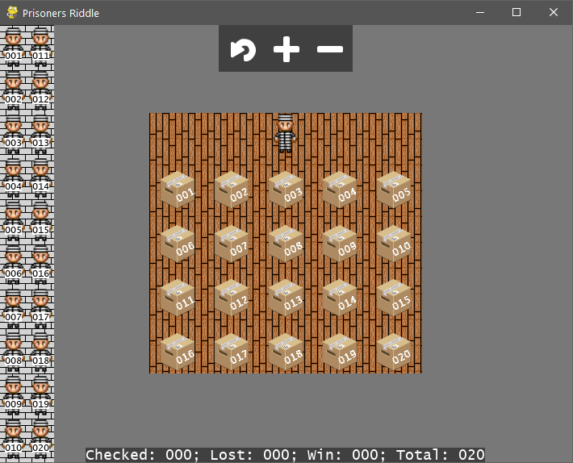

## 100 Prisoners Riddle

 This is inspired by the [Veritasium's video](https://www.youtube.com/watch?v=iSNsgj1OCLA). This is just a visual 'simulator' to you test for yourself any strategy you want.
### How to use:
  - click on a prisoner on the line to enter him into the room;
  - click on a box to open it;
  - if the number inside the box is the same of the prisoner, he will leave the room and all the boxes will be closed;
  - if the boxes opened reach the maximum limit, the prisoner will leave the room and all the boxes will be closed.

   

---

### The ridle:
 * 100 prisoners numbered 1-100
 * Slips with their numbers are randomly placed un 100 boxes in a room
 * Each prisoner may enter the room one at a time and check 50 boxes
 * They must leave the room exactly as they found it and can't communicate with the others after
 * If all 100 prisoners find their number during their turn in the room they will all be freed. but if even on fails, they will all be executed
 * What is their best strategy?

---
The art images was taken from [OpenGameArt](https://opengameart.org) website.
 - [prisoner](https://opengameart.org/content/prison-jumpsuit);
 - [box](https://opengameart.org/content/isometric-box);
 - [floor](https://opengameart.org/content/wood-floor);
 - [bricks](https://opengameart.org/content/32-x-32-bricks);
 - [buttons](https://opengameart.org/content/game-icons).
---
### Links:
 * [The Riddle That Seems Impossible Even If You Know The Answer](https://www.youtube.com/watch?v=iSNsgj1OCLA)
 * [Simulation Of The 100 Prisoners Riddle](https://www.youtube.com/watch?v=WALOO-qlSVk)
 * [Wikipedia article](https://en.wikipedia.org/wiki/100_prisoners_problem)